[](https://github.com/NeroJz/nd-ci-cd-pipeline-azure/actions/workflows/main.yml)

# Overview
This repository implements the CI/CD pipeline for Python Flask Machine learning app using Microsoft Azure. 

## Project Plan
* [Trello](https://trello.com/b/C3ceeWmW/flask-ml-task)
* [Project Planning](https://docs.google.com/spreadsheets/d/1dxMQlkFInCwCUSMQBhnbmbo_12ffJuVlZAwjiTnfZjo/edit?usp=sharing)


## CI/CD Architectural
The flow diagram below depicts the high level of the architecture:
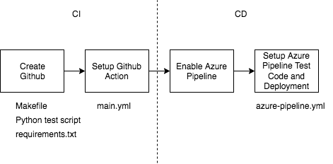


The architectural Diagram can be divided into two parts as follow:

### Azure CI
The diagram below depicts the architecture of the Continuous Integration
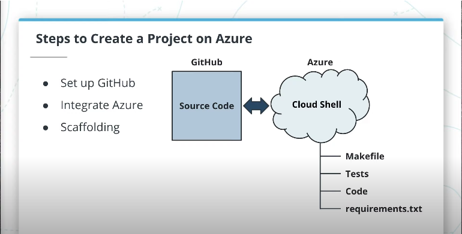

### Azure CD
The diagram below depicts the architecture of the Continuous Delivery
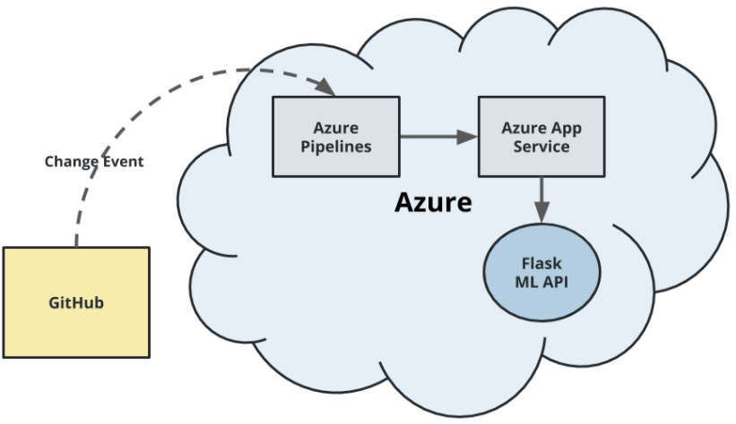


## Instructions

### Clone Project into Azure Cloud Shell
Open the Azure Cloud Shell and clone the Github repository with the following command:
```
git clone GITHUB_URL_REPO
```
Replace the GITHUB_URL_REPO with the URL that stores the source code.

You can navigate to the folder after it has cloned the repository.

Example:<br/>
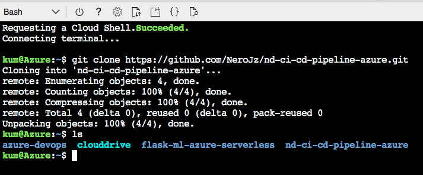

### Creating the Virtual Environment
On Azure shell, enter the following command to create virtual environment:
```
python3 -m venv ~/.my-repo
```

The <i>my-repo</i> is the name used for this project. You can use any name as you wish.

Once the virtual environment was created, enter the following command to activate the environment:
```
source ~/.my-repo/bin/activate
```
Example:<br/>
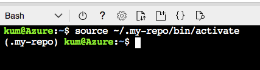


### Install the dependencies via Makefile
Once you have the virtual environment installed, you can run the Makefile via:

```
make all
```

The command will install the dependencies and run the test script.

Output:<br/>
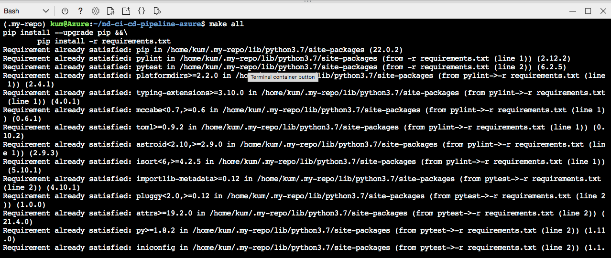

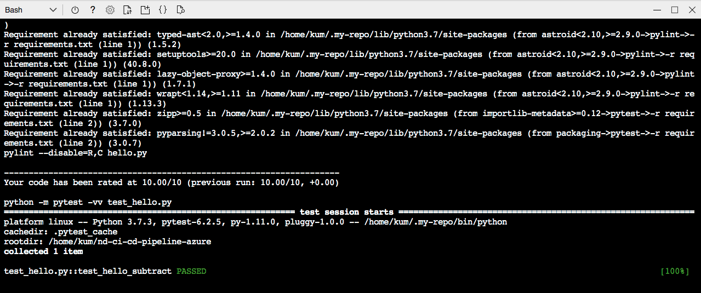


### Setup the Github Actions
#### Create the workflow
In Github, navigate to the repository that stores the source code.

Then: Github > Actions > Set Up a workflow yourself.

The browser will open the default template (e.g. main.yml). Replace the content of the template as following:

```
# This is a basic workflow to help you get started with Actions

name: Python application test with Github Actions

on:
  push:
    branches: [ master ]
  pull_request:
    branches: [ master ]

  # Allows you to run this workflow manually from the Actions tab
  workflow_dispatch:

jobs:
  build:
    runs-on: ubuntu-latest
    
    steps:
    - uses: actions/checkout@v2
    - name: Set up Python 3.6
      uses: actions/setup-python@v1
      with:
        python-version: 3.6
    - name: Install dependencies
      run: |
        make install
    - name: Lint with pylint
      run: |
        make lint
    - name: Test with pytest
      run: |
        make test
```

Save and commit the changes. The build shall be triggered after saving the commit. The output should look like below:

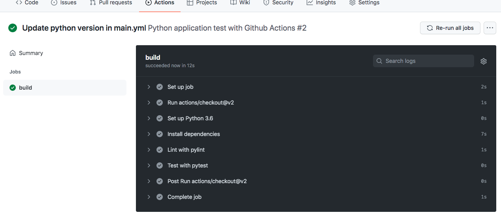


### Provision the target Azure App Service
Go back the Azure Cloud Shell.

Run to pull the latest change of the repository.

```
git pull
```

To deploy the app to Azure App Service, enter the following command:

```
az webapp up -n <NAME_OF_THE_APP> --resource-group <RESOURCE_GROUP_TO_STORE_THE_APP>
```

The <NAME_OF_THE_APP> is the name of this APP, whereas, the <RESOURCE_GROUP_TO_STORE_THE_APP> is the resource group that stores this application. You can give any name for both NAME_OF_THE_APP and RESOURCE_GROUP_TO_STORE_THE_APP.

Once the webapp command has successfully run, the app will be deployed.

You can check the app on the resource group via Azure Portal
Output:<br/>

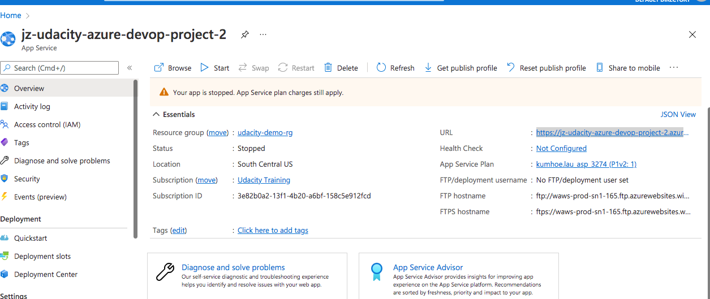

Or from the URL (e.g.https:<NAME_OF_THE_APP>.azurewebsites.net): <br/>
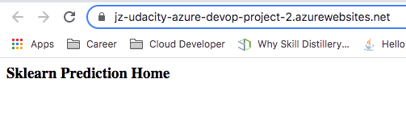


### Configure the Azure Pipeline
The steps of the configuration can refer the official docs of [Microsoft Azure Devops](https://docs.microsoft.com/en-us/azure/devops/pipelines/ecosystems/python-webapp?view=azure-devops)

Once the configuration of Azure Pipeline was applied, any update on the master branch in the repository will trigger the pipeline to run and deploy the application.

The images below depicts the expected result:

Output:<br/>

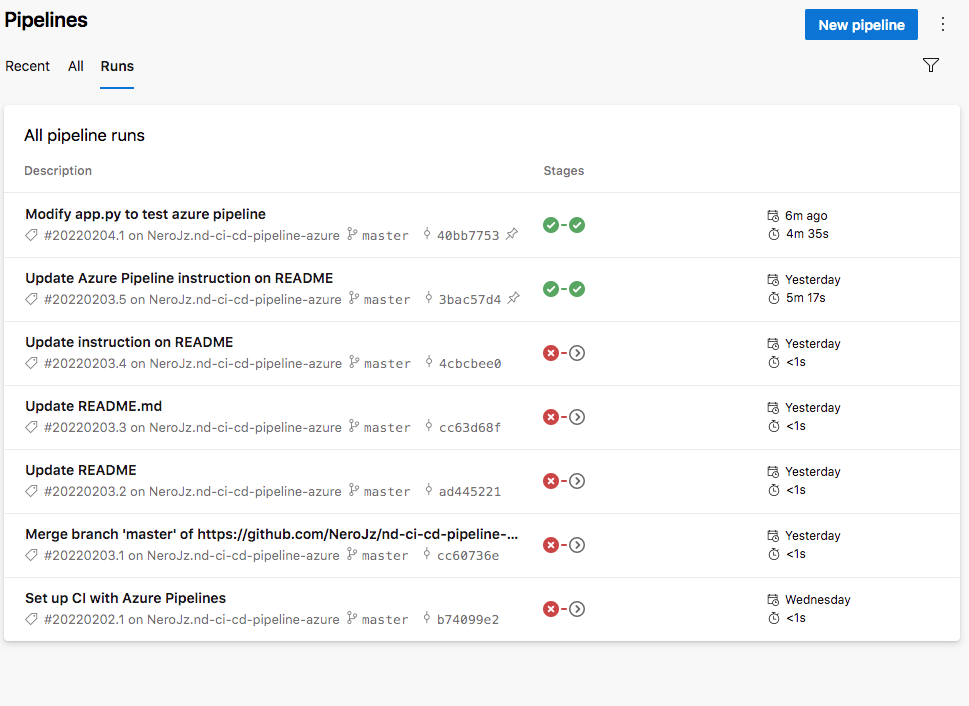


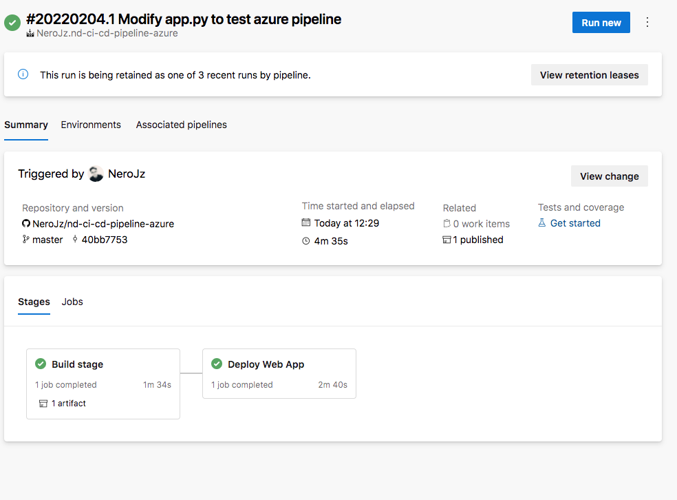


### Testing on the Application
Before testing the application, we need to update the enpoint of the <i>make_predict_azure_app.sh</i> shell file.

On the Azure shell, enter:

```
vim make_predict_azure_app.sh
```

Replace the <yourappname> with the app name use for the deployment. Here, use jz-udacity-azure-devop-project-2

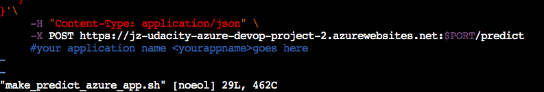


Once the app name was updated, you can test the prediction by running the make_predict_azure_app.sh on the terminal:

```
./make_predict_azure_app.sh
```

The following output shall be displayed:

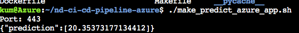

In addition, you can streamed the log files from the deployed application using:

```
az webapp log tail -n <YOUR_APP_NAME> 
```

The output: <br/>
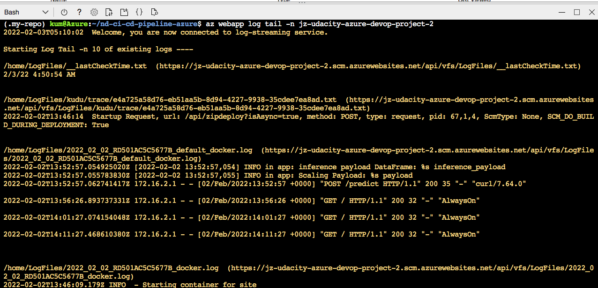

## Locust
The Locust result is shown as below:

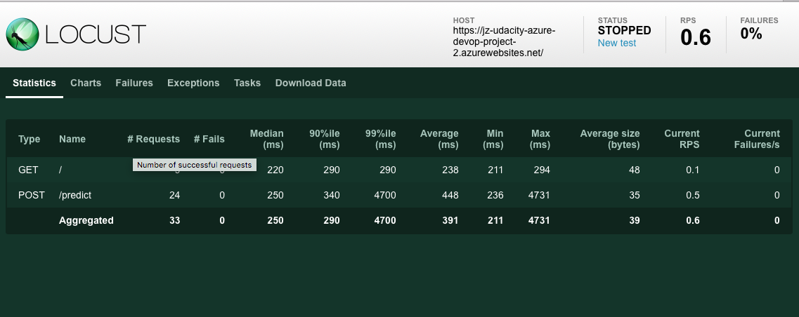


## Enhancements
Some enhancements can be considered in future, including:
1. Docker
2. Kurbenetes

Docker is a container technology that helps to isolate the application (a.k.a containerized application) from the environment (staging or production). In order words, an image application runs in an environment, e.g. staging, will able to run in other environments like production. The app can run independently when deploy to any environment. In addition, the instance of Docker app consumes less resource comparing to the instance of virtual machine.

The Kurbenetes is another open source system that helps to manage the containerized applications like deployment, load balancing and scaling. Kurbenetes can be viewed as an 'orchestrator' that can scale up the containerized application to handle more incoming request or vice versa.

## Demo 
[Youtube](https://youtu.be/kMC6DevVyd8)


